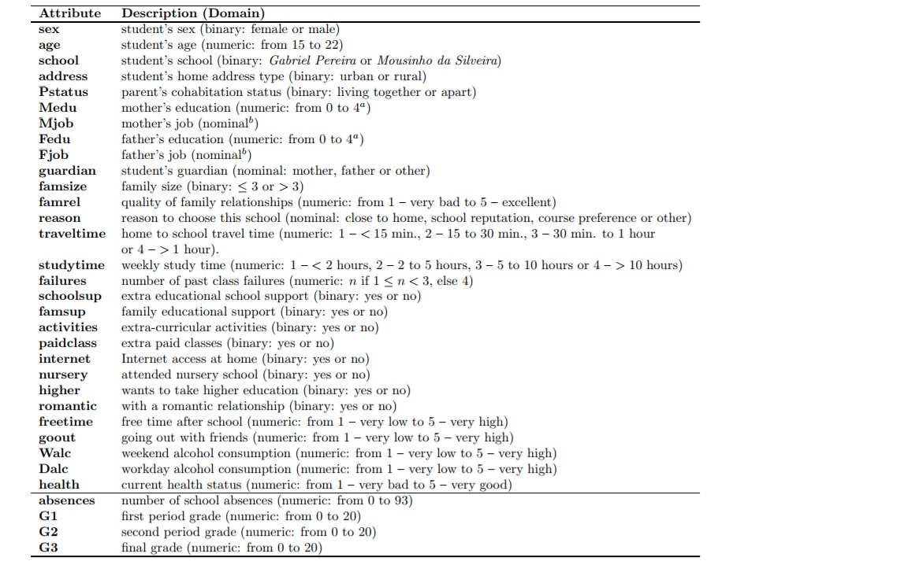

```{r global_options, include=FALSE}
knitr::opts_chunk$set(
  echo = TRUE,
  comment = NA,
  cache = FALSE,
  message = FALSE,
  warning = FALSE
)
```
#1. Research question and hypothesis
+ <span style="color:green"> What variables besides the previous grades affect the final grades of students ? </span>
+ <span style="color:green">Do these factors differ between the two subjects studied ?</span>
+ <span style="color:green">Can we predcit the final grades of students based on some of these factors ?</span>
+ Hypothesis : the previous grades will highly impact the final grade  (but am curious to see what other variables can be related to the grades and I believe different predictors are related differently to each subject)

#2. A link to data wrangling script: [finalProj_wrangling](https://github.com/Rigbe-ods/IODS-final/blob/master/final_project_dataWrangling.r)

#3. Description of data and its variables
The data contains demographic, social and performance related information about students in two Portugese high schools. The variables in the dataset with their descriptions are shown below.



## 4. Explorations of the variables of interest

In multivariate regression, even though it is tempting to use all predictor variables to explain the response,we must make sure that the predictors we are using are not explaining the same variance in our response variable because then they will be redundant. To test multicolinearity we could check the scatter plot matrix of all variables (using R's pairs() function for instance) or we could also use the Variance Inflation Factor (VIF) test ($VIF = \frac{1}{1 - R^2_1}$). Since the number of variables to be plotted would be very large with pairs, I will only plot the scatter matrix of a few of those variables(Medu vs Fedu and Dalc vs Walc and also the G1 and G2s) that were discarded for having high VIF(>3) (from the data wrangling part) to show those values were indeed correlated. 

```{r,fig.width=4, fig.height=4,fig.show='hold'}
library(ggpubr)

math_por <- read.table("data/math_por.csv",header=T, sep="\t")
pairs(math_por[c(31,32)], panel = panel.smooth)
pairs(math_por[c(38,39)], panel = panel.smooth)

ggscatter(math_por, x = "Medu", y = "Fedu", 
          add = "reg.line", conf.int = TRUE, 
          cor.coef = TRUE, cor.method = "spearman",
          xlab = "Medu", ylab = "Fedu")
ggscatter(math_por, x = "Dalc", y = "Walc", 
          add = "reg.line", conf.int = TRUE, 
          cor.coef = TRUE, cor.method = "spearman",
          xlab = "Dalc", ylab = "Walc")
```


The histogram and bar plots of my response variables (G3.math and G3.por) both in their continous forms as well as the binary variables I created from these continous variables in the data wrangling part is shown below. For the 85 students selected for the analyses in this project, most students failed(their grades were below 13, maximum being 20) in both subjects.   

```{r,fig.width=4, fig.height=4,fig.show='hold'}
library(ggplot2)

ggplot(math_por, aes(x=G3.math)) + geom_histogram()+theme_pubclean()
ggplot(math_por, aes(x=G3.por)) + geom_histogram()+theme_pubclean()

mathPor2_scaled <- read.table("data/mathPor2_scaled.csv",header=T, sep="\t")
ggplot(mathPor2_scaled, aes(x=G3_binary.math)) + geom_bar(width=0.5)+theme_pubclean()
ggplot(mathPor2_scaled, aes(x=G3_binary.por)) + geom_bar(width=0.5)+theme_pubclean()

```

#5. Method description
##5.1-Linear regression

First I will do a linear regression of the final math and portugese grades (separately) with all the variables except those that might be specific to the two subjects(such as weekly study time,extra educational school support,family educational support,extra paid classes) which is done in the data wrangling part and also except the previous two grades.Then I will regress my response variables against those predictors that had low VIF values as described above and also in the data wrangling part. 

Since the previous two grades would highly affect the final grade, I wanted to see which other variables might affect the final grade and so did not include the previous grades in my analyses. I am fitting models separately for the two subjects to see if the signinficant explanatory variables differ and i could have done this before merging the two datasets but i wanted to do it on only those students whose info matches on almost all variables between both subjects.

In Linear Regression, we are looking for a linear combination of predictor variables that explain(covary) with our response variable. In this case, the final grade will be our response variable and we will regress it against the predictors we chose. 

<span style="color:violet"> **The summary of the fitted model that used all the predictor variables(except the subject specific ones and the previous two grades) for the final mathematics grade is shown below**</span>

```{r}
library(dplyr)
library(MASS)
library(car)
library(VIF)
math_por <- read.table("data/math_por.csv",header=T, sep="\t")

#math
math2 <- math_por %>% dplyr::select(-one_of('G1.math','G2.math','paid.por','G1.por','G2.por','G3.por','studytime.por','schoolsup.por','famsup.por'))


mathGrade_lm<-lm(G3.math~., data=math2)

summary(mathGrade_lm)

# this we got from the data wrangling part that used VIF iteratively with lm to backward select predictor variables (taken from this website https://beckmw.wordpress.com/2013/02/05/collinearity-and-stepwise-vif-selection/)
```
<span style="color:violet">**And the summary of the other model that doesn't include the variables 'medu, traveltime,walc' based on the VIF analysis is shown below.**</span>

```{r}
form.in = "G3.math ~ school+sex+age+address+famsize+Pstatus+Fedu+Mjob+Fjob+reason+nursery+internet+guardian+failures+activities+higher+romantic+famrel+freetime+goout+Dalc+health+absences+studytime.math+schoolsup.math+famsup.math+paid.math"

mathGrade_lm2<-lm(form.in,data=math2)

summary(mathGrade_lm2)
```

<span style="color:violet">**The same is done for the portugese final grade and the summary of the two models are shown below.**</span>

```{r}
#portugese
por2 <- math_por %>% dplyr::select(-one_of('G1.por','G2.por','paid.math','G1.math','G2.math','G3.math','studytime.math','schoolsup.math','famsup.math'))
porGrade_lm<-lm(G3.por~., data=por2)
summary(porGrade_lm)

form.in.por = "G3.por ~ school+sex+age+address+famsize+Pstatus+Fedu+Mjob+Fjob+reason+nursery+internet+guardian+failures+activities+higher+romantic+famrel+freetime+goout+Dalc+health+absences+studytime.por+schoolsup.por+famsup.por+paid.por"

porGrade_lm2<-lm(form.in.por,data=por2)

summary(porGrade_lm2)

```

##5.2-LDA
As an additional method, I used LDA to classify students and predict students' Portugese and mathematics grades based on the numeric variables only which were scaled in the data wrangling part (and i have also removed collinear varibales before fitting LDA).In LDA we are looking for a linear combination of features that will separate two or more classes as such it can also be used for dimensional reduction. Since the response variables must be categorical, I categorized the grades in to 'pass'(>=13) and 'fail' before fitting the LDA models.

Again I am fitting models separately for the two subjects and taking 80% of the data for training and the rest 20% for testing. 

<span style="color:violet">**The plots of the fitting and the cross tabulation tables for the mathematics final grade are depicted below.**</span>

```{r}
set.seed(54)
mathPor2_scaled <- read.table("data/mathPor2_scaled.csv",header=T, sep="\t")
#math
math3 <- mathPor2_scaled %>% dplyr::select(-one_of('G3_binary.por','G1.math','G2.math','G1.por','G2.por','studytime.por','Fedu','Walc'))
# sample 80 percent of the data, i.e. you have the row indices here
ind <- sample(nrow(math3),  size = nrow(math3) * 0.8)

# based on those indices we choose our training set
train <- math3[ind,]
# the rest is the test data 
test <- math3[-ind,]

# we know the correct classes from our test set
correct_classes <- test$G3_binary.math

# remove the grade classes, so that we replace them with the predicted values from the next steps
test <- dplyr::select(test, -G3_binary.math)

lda.fit <- lda(G3_binary.math ~ . , data = train)

classes <- as.numeric(train$G3_binary.math)

plot(lda.fit, dimen = 2,col = classes,pch=classes)

lda.pred <- predict(lda.fit, newdata = test)

# cross tabulate the results
table(correct = correct_classes, predicted = lda.pred$class)
```

<span style="color:violet">**And for the Portugese:**</span>

```{r}
set.seed(42)
# por
por3 <- mathPor2_scaled %>% dplyr::select(-one_of('G3_binary.math','G1.math','G2.math','G1.por','G2.por','studytime.por','Fedu','Walc'))

# sample 80 percent of the data, i.e. you have the row indices here
ind.por <- sample(nrow(por3),  size = nrow(por3) * 0.8)

# based on those indices we choose our training set
train.por <- por3[ind.por,]
# the rest is the test data 
test.por <- por3[-ind.por,]

# we know the correct classes from our test set
correct_classes.por <- test.por$G3_binary.por

# remove the grade classes, so that we replace them with the predicted values from the next steps
test.por <- dplyr::select(test.por, -G3_binary.por)

lda.fit.por <- lda(G3_binary.por ~ . , data = train.por)

classes.por <- as.numeric(train.por$G3_binary.por)
plot(lda.fit.por, dimen = 2,col = classes.por,pch=classes.por)

lda.pred.por <- predict(lda.fit.por, newdata = test.por)

# cross tabulate the results
table(correct = correct_classes.por, predicted = lda.pred.por$class)
```


#6.Results and Interpretations

In the first Linear regression model where I didn't select predictors with low VIFs, the value 'home' of the variable 'reason to choose school', appears to have a high statistically significant relation to the final mathematics grade and the relation is negative, i.e. the final grades are lower for those students who chose a school only because it was closer to home. In addition, the variables age,whether or not the parents are living together, the mother's job categorized as other, Father's job categorized as health and civil services, the home to school travel time and previous school failures are also related to the final grades. However, the sign of the relationships between some of these variables and the final grade are not very initutive. For instance, I would expect the final grades of students whose parents are living together to increase and not decrease.  

For the final Portugese grade on the contrary, only the 'extra educational school support' variable(with value yes) appears to be statistically significantly related to the grade and the relation is negative which again doesn't make sense. 

The adjusted residual square errors of the all-variable models of both the final mathematics and Portugese grades are very low indicating the fit is not optimal (using these models we could explain only ~35% and 12% of the variations in our response variables respectively). We can also check the distribution of the residuals from diagnostics plots of the lm objects to assess if the following key assumptions are met:

* The mean of the residuals is close to 0: <span style="color:red"> yes for both subjects </span>
* The residuals should be homoscedastic: <span style="color:red"> yes for both (also as checked by the ncvTest, P-values > 0.05).</span>
* The probability distribution of the errors follows a normal (Gaussian) distribution: <span style="color:red"> yes for both as can be seen from the qqplots.</span>
* The residuals are independent of one another (not autocorrelated): <span style="color:red"> yes for both also as was checked by durbinwatsonTest (a value ~2)</span>
* There should be no disproportionately influential points: <span style="color:red"> yes for both as all values of the Cook's distance are less than 1</span>
```{r}
mean(mathGrade_lm$residuals) 
mean(porGrade_lm$residuals) 

library(car)

ncvTest(mathGrade_lm)
ncvTest(porGrade_lm)
durbinWatsonTest(mathGrade_lm)
durbinWatsonTest(porGrade_lm)

OP <- par(mfrow = c(2,2))
plot(mathGrade_lm, which = c(1:4))
par(OP)

library(ROCR)

prediction(as.numeric(lda.pred$class), as.numeric(correct_classes)) %>%
  performance(measure = "tpr", x.measure = "fpr") %>%
  plot(col="green")


```

<span style="color:violet">For Portugese:</span>
```{r}
OP <- par(mfrow = c(2,2))
plot(porGrade_lm, which = c(1:4))
par(OP)


prediction(as.numeric(lda.pred.por$class), as.numeric(correct_classes.por)) %>%
  performance(measure = "tpr", x.measure = "fpr") %>%
  plot(col="blue")

prediction(as.numeric(lda.pred.por$class), as.numeric(correct_classes.por)) %>%
  performance(measure = "auc") %>%
  .@y.values

prediction(as.numeric(lda.pred$class), as.numeric(correct_classes)) %>%
  performance(measure = "auc") %>%
  .@y.values

```


On the other hand, for the models that used variables with low VIF values, while for the final mathemaics grade the 'reasonhome, Mjobhealth, PstatusT and schoolsup.mathyes' had siginificant relations, for the Portugese final grade, as in the previous model only 'schoolsup.poryes' had a significant relationship. There wasn't also a significant difference from the previous models interms of the adjusted R-squared and the p-values of the F statisitics as assessed using the anova() method (p-value 0.22).

To compare either of these methods to a model that uses only the previous grades I also fitted a model that regresses the final grade against the two previous grades. As expected the fit of the model is improved as can be judged from the adjusted R-squared which increased to 0.78 when we used the previous grades.  

```{r}
math_lm5 <- lm(G3.math~G1.math+G2.math, data=math_por)
summary(math_lm5)

anova(mathGrade_lm2,mathGrade_lm)
```


#7.Conclusions and Discussions

As hypothesized the predictors with significant effect on the final grades were different for each subject. Also, as hypothesized the models that regressed the final grades against only the previous grades had a better fit as assessed by the adjusted R-squared value. However, contrary to my initial assumptions(ambitions), not all the relationships I saw between the other predictor variables and the final grades were intituive which leads me to believe that the model fits were poor. Also the LDA without the previous grades performed poorly as assessed by the area under the curve (AUC) values below 0.5. Therefore, eventhough the information collected about the students were very interesting, the particular methods I employed or the predictors I chose to mine the relationships might not have been well suited.  

